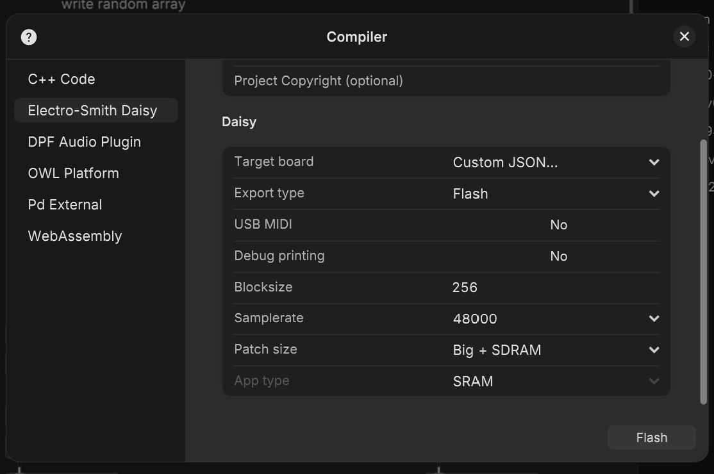

# FM BleepBloop for Synthux Simple Touch

Made with Plugdata by jonwtr.

In its simplest description FM_BleepBloop is just a complex FM oscillator (based on the video by Simon Hutchinson, link under sources), that makes strange and out of tune noises.

Runs on [Synthux Simple Touch](https://www.synthux.academy/shop/touch-2) (Daisy Seed + mpr121 touchsensor)

🔧 Core Controls
- 4 Knobs (Pot 0–3): FM modulation
- 2 Pots (Pot 4–5): Attack & Decay
- 2 Faders:
- Left: Master Volume
- Right: Sequencer Tempo
- 11 Touchpads: Pad-triggered interaction, recording, mode switching, sequence control
- Multiple Switches: Sequence length and step probability

🎹 Modes & Features
- Simple Mode: Play live with FM knobs
- Array Mode: Use 7 pre-saved sounds
- Sequencer: Internal 8-step playback with probabilistic control
- Randomizers: For sequence, modulator animation, effects (panning, combfilter, attack/decay)

🎼 MIDI & Clock
- Touchpads play MIDI note numbers 37–43
- 88 total arrays via external MIDI (note range A0–C8)
- Clock sync via pin trigger (24PPQN timing)
- MIDI over serial supported (USB MIDI not currently working)

---

(There's a version with black behind the text in the /img folder.)

---
## Installation instructions

download the latest .bin file v0.8.1 _gateout_ [FM_bleepbloop_touch_v0_8_1gateout.bin](FM_bleepbloop_touch_v0_8_1gateout.bin)

Use the [Daisy Seed web programmer](https://flash.daisy.audio/) to upload this file to your Simple Touch.

### pins used for gate in & out:

**Added jacks to Simple Touch:**

By connecting a mono jack to ground and a free analog pin, you can safely use most clock signals. Note that the clock signal should be in Daisy's tolerance range, i.e. 0..+5V. (E.g. Volca's, Denki-oto OMX-27)

 - this is using the custom json file where the pin D28 is gate in and pin D25 is gate out. (pin numbers according to the Daisy pin diagram)

Daisy pin D25 = pin S40 on the Simple Touch PCB

Daisy pin D28 = pin S43 on the Simple Touch PCB

---

## summarized controls table:

Here's a table listing all the controls for FM_BleepBloop, For more detailed info see below.

---

🎛️ FM_BleepBloop Control Summary

| **Type**           | **Control**                     | **Label / Pad / Pot**          |
|--------------------|----------------------------------|--------------------------------|
| **Faders**         | Volume                          | Left Fader                     |
|                    | Sequencer Tempo                 | Right Fader                    |
| **Knobs (Pots)**   | FM Feedback                     | Pot 0                          |
|                    | Sine Oscillator 1               | Pot 1                          |
|                    | Oscillator 2 Modulating 1       | Pot 2                          |
|                    | Sine Oscillator 2               | Pot 3                          |
|                    | Attack                          | Pot 4                          |
|                    | Decay                           | Pot 5                          |
| **Touchpads**      | Mode Toggle                     | P1                             |
|                    | FX Randomizers                  | P2                             |
|                    | Sequence Randomizer             | P0                             |
|                    | Fill FM Arrays Randomly         | P1 + P3                        |
|                    | Toggle Modulator Animation      | P1 + P7                        |
|                    | Audio in Toggle                 | P10 + P11                      |
|                    | Listen to audio in Tap Tempo    | P11 + P5                       |
|                    | Record FM Knobs to Array        | P10 + P3                       |
|                    | Toggle Main Sequencer           | P11 + P7                       |
|                    | Secondary Sequencer Probability | P11 + P4 (−), P11 + P6 (+)     |
|                    | Tempo Multiplier                | P11 + P8 (−), P11 + P9 (+)     |
|                    | Panning Randomizer              | P2 + P3 (−), P2 + P7 (+)       |
|                    | Combfilter Toggle / Randomize   | P2 + P4 (toggle), P2 + P6 (randomize) |
|                    | Randomized Attack/Decay         | P2 + P8 (−), P2 + P9 (+)       |
|                    | Internal Sequencer Steps        | Pads P3–P9                     |
| **Switches**       | Sequence Length (2/4/8)         | Switch 1                       |
|                    | Step Probability                | Switch 2                       |

---

## Detailed Manual / controls

This manual has a picture that is color coded to indicate which pads are somehow connected, indicating when they are to be held as multi-touch triggers.

Some features can be set with different values, with a left pad or right pad to decrease or increase as you hold the parent pad.

The userLed (next to the boot button) on the Daisy Seed will indicate when thresholds are reached. (implementation is buggy atm)

The userLED will also blink in sync when the sequencer is running.

### Faders

Left fader: volume audio out
Right Fader: tempo internal sequencer.

### Knobs

**Pot 0 - 3: FM controls**
In practice this really is just twist and listen.
What each one supposedly does:

- **0 - feedback**
- **1 - sine oscillator 1**
- **2 - oscillator 2 modulates oscillator 1**
- **3 - sine oscillator 2**

- **4 - attack (close to zero - 1000ms)**
- **5 - decay (close to zero - 1000ms)**

### Touchpads

**P1 - toggle between Simple and Array mode**

- simple mode > plays FM knobs live
- array mode > plays recorded pads
        - starts up in array mode with seven pre-saved sounds (can be changed in the .pd file), will always reboot with these sets. Recorded parameters are not saved on power down.
        - attack / decay work in either mode

### **Simple mode**

- In Simple mode the FM parameters can be tweaked live (0-3)
- the playable pads (P3-P9) will vary the set sounds mildly, they are actually using midi note numbers to change the value of knob 3 (sine oscillator 2).

### **Array Mode**

**P1 + P3 - fill all arrays with random FM values.**

**P1 + P7 - Toggle random animated modulator between Simple and Array mode.**

- as if you'd repeatedly touch P1 on/off
- There's a smoothing as it goes between modes, making a particular type of glide sound.

#### **Recording**

> [!NOTE]
> *recording* is not actual sound recording, but saving the parameters to the array

**When recording is on the userLED will blink** in a particular loop, this might be overseen when the sequencer is also running as that also triggers the LED.

**P10 + P3 - Record 4FM knobs to array**

- toggle on/off; press and hold P10 + touch and release P3 to toggle 
- In Array mode the FM knobs only work when recording is active.
- When recording is not active you can play the seven sounds, or one ot the total of 88 slots when using midi
- nothing besides the static FM values is saved

#### **Sequencer**

> [!WARNING]
> running the sequencer while recording mode is on, will overwrite any played step with the FM knobs!

- the sequencer will run in both Simple and Array mode
- it will play the 7 pads as if you'd manually touch them in either mode
- internal sequencer follows the right fader tempo and is unsynced from external syncing, meaning that when turned on and you have an external other tempo, they could both trigger steps.
- sequence length is set between, 2, 4 and 8 steps.

**P11 + P7 - (internal) sequencer on/off**

- toggle on/off; press and hold P11 + touch and release P7 to toggle

**P10 + P11 - toggle audio in out/off**

- toggle on/off; press and hold P11 + touch and release P10 to toggle

**P10 + P5 - start listening to ext audio beat for sync**

- to ensure right slider doesn't intervene, set it at lowest position.
- toggle on/off; press and hold P10 + touch and release P5 to toggle
- functions like a tap tempo, averages timing from every 4 input triggers. This better method was shown to me by user denisC on discord. (tempo is held after toggling off)
- audio in is detected with or without active P10 + P11
- LED will blink on trigger detection.

**P0 - sequence randomizer**

- trigger this pad to fill 8 steps with a random touchpad slot
- switches influence the randomized fill:

**Switch 1 - sequence length 2 / 4 / 8 steps**

- 2 steps (left) > 4 steps > 8 steps (right)
- changing the length will just play those first steps of the 8 step sequence.
- As long as you do not change the randomized fill the 8 steps are playing in the same order

**Switch 2 - Chance a step plays**

- sets each step to on or off
- probability from always 1/1 (down) to > 1/2 > 1/5 (up)
- each time the randomizer P3 is triggered, a random pas and a chance is sent to each step. 
- when a step is off, there is a pause or silent step. So a random series of 8 steps could look like this:
    - P5 - rest - P5 - rest - rest - P1 - P4 - P1

#### Secondary random sequencer

**P11 + P4 / P6 - secondary total random sequencer**

- 6 levels of probability
    - Chance: press and hold P11 and trigger repeatedly either P4 (minus) or P6 (plus) to set the chance to trigger pads more frequently
- picks non repeating, random pads
    - This sequencer, is linked to the same tempo grid;
    - but will not follow a set sequence of steps
- Note this sequencer will run even when the main sequencer is turned off.
- To turn off the secondary sequencer repeatedly trigger P11 + P4, which will land on the value chance of 0 probability.
- If you want to play a totally random sequence without any steady order, only play this sequencer. 

**P11 + P8 / P9 - tempo multiplier**

- press and hold P11 + trigger either P8 to decrease the multiplier or P9 to increase. 
- multiplier is literally doubling the speed
- multiple taps to the left pad P8 will land base tempo

#### **FX randomizer**

**P2 + P3 / P7 - random panning**

- 3 setting: none > some > max randomization
- press and hold P2 and trigger either P3 to decrease or P7 to increase

**P2 + P4 / P6 - combfilter**

- the combilter can result into sounding like a type of delay or resonator
- press and hold P2 + trigger P4 to toggle the combfilter effect on or off
- press and hold P2 + trigger P6 to load a randomized set of values to the combfilter

**P2 + P8 / P9 - randomized attack decay for each step** 

- works in conjunction with the knob values (adding)
- 3 levels of amount of variation
- press and hold P2 and trigger either P8 to decrease or P9 to increase the amount 
- trigger left side multiple times (3x) to reach 0 setting it to off and only use the knob settings.

---

## Sources

[How to Create a Sequencer in Pure Data!](
https://youtu.be/8Nzaswa5C7g?si=Mu-7KD3Pu0qM-faMConcepts) - tutorial by Sound Simulator (Takumi Ogata) 

[Pd Patch from Scratch: Complex FM Oscillator (Pure Data, No Talking)](https://youtu.be/Fh2unJaNPuY?si=DqRLbs0EuWyFv-O8) - by Simon Hutchinson | This is the FM patch I'm using.

---
## notes 

Please do feel free to further tweak this and let me know what can and should be improved.

> [!NOTE]
> running this synth at the max blocksize of 256, as the synth got crackling distorted at smaller sizes.

> [!NOTE]
> This plugdata patch looks messy and can use optimizing, more tidy and grouped lay out in the pd file, but most of all I should start using abstreactions and or making blocks I could reuse.

## Youtube demo's

YouTube demo of v0.4 + second Simple Touch running selfdistort_touch

https://youtube.com/shorts/Ys92nRRQLP4

YouTube demo of v0.4 + Wingie2 resonator and a little techno drum.

https://youtube.com/shorts/Z75hTTqJfyg

Youtube demo of v0.7 showing FM_BleepBloop clock synced with Plinky.

https://youtu.be/S7FRJoiw604?si=t8SaG-FeW1s61ztc

More video's on my YouTube and Instagram pages. 

---

## QUICK INSTALL

### V0.8

Download the [Binary file FM_bleepbloop_touch_v0_8.bin](/FX-Instruments/FM_bleepbloop_touch/FM_bleepbloop_touch_v0_8.bin)

and flash using the [Daisy web programmer](https://flash.daisy.audio/)

You might need to install the bootloader first. (last tab on that page)

### update notes from v 0.7 +

- updated:
    - panning was set to left as default on booting: fixed
    - audio in can be toggled on/off by using **P10 + P11**

- added a temposync function by using the audio in as a tap tempo source. So you could use a 4/4 beat to set the tempo if no midi or clock is installed.
    - To turn on beatsyncing by audio use **P11 + P5**, the led will flicker on beat detection. (an improved version needing less calculation was shown to me by user denisC on Discord)

- resolved bugs / issues:
    - **multitouch combo's no longer trigger notes when the modulator main pas is touched.**
        - e.g. recording is set via multitouch P10 + P3, that meant that turning off recording was also programming the switch button to the last setup sound. (though programming does need a double tap)
        - e.g. when changing panning with P2 + P3/P7, notes of P3 and P7 would trigger. 

- to do / want list
    - bughunting
    - update this manual and the manual image
    - create video manual
    - move on :-) 
    - Finding interesting patterns can sometimes take a while, in the  future i should look into using a few presets as well as the random functions. 

---

## Notes on clock and midi

### midi

- Unfortunately USB midi is broken, the Daisy is not recognized as a midi device when this .bin is installed.
- Midi over serial works perfect. I'm probably the only one for now that has added midi trs to Simple Touch (using a denki-oto breakout).
- The internal sequencer will follow the start and stop commands, the pads are set to midi note numbers 37 - 43

| MIDI Note Number | Note Name |
|------------------|-----------|
| 37               | C♯2       |
| 38               | D2        |
| 39               | D♯2       |
| 40               | E2        |
| 41               | F2        |
| 42               | F♯2       |
| 43               | G2        |

- The start stop command will play the set of 8 steps.
- when using an external sequencer you might want to omit those messages
    - Play any of 88 arrays with the range of A0 (MIDI note 21) to C8 (MIDI note 108)
- there are no CC messages linked in the current version (v0.7)

### Clock - trigger**

- I only have a Plinky to test this functionality, but I got tempo syncing working, as soon as Pin 43 (D28) receives a trigger the next step will be played.
- timing is calculated with 24PPQN values, yet tends to be a slower division than midi. Using the multiplier (P11 + P8/P9) will help get to a faster division.

---

---

## Plugdata - notes on uploading / flashing

This patch is pretty chaotic, and has lot's of room for improvement such as:

- Use of subpatches
- further optimizations

The patch runs best with these settings:

the custom json used depends on wether you use the gate-out version.

See the two custom json files in the main folder: 
- [simpletouch_mpr121_knobs_sliders_led-gate.json](../../Custom-JSON/simpletouch_mpr121_knobs_sliders_led-gate.json)

- [simpletouch_mpr121_knobs_sliders_led-gatein28out25.json](../../Custom-JSON/simpletouch_mpr121_knobs_sliders_led-gatein28out25.json)