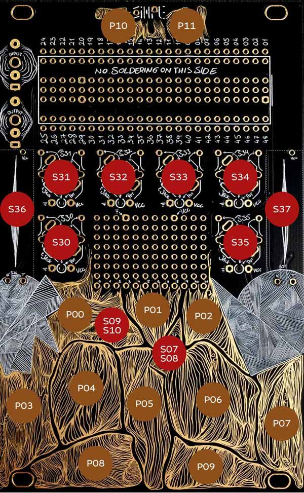

# FM BleepBloop for Synthux Simple Touch

Made with Plugdata by jonwtr.

Four controls to tweak a FM synth sound.
Using a few simple tweaks to change input by converting midi note numbers.

## two main versions:

### V 0.1 simple stripped down

[FM_bleepbloop_touch_v0-1.pd](/FX-Instruments/FM_bleepbloop_touch/FM_bleepbloop_touch_v0-1.pd)
    
Playable with trs / serial midi (and sometimes usb midi.)
    
Download ([.bin](/FX-Instruments/FM_bleepbloop_touch/FM_bleepbloop_touch_v0_1.bin))
- USB midi is working sometimes, weird and inconsistent issue? The device sometimes get recognized by my windows pc's and android phone, sometimes it doesn't.

### V 0.5 full randomized sequencer (array) + simple in one patch
---
> v0.5.1 
- adding a tempo multiplier [seq P10 + P8/P9]
- a second randomized tempo, based on main tempo devisions and chance (sound remains mono, sounds cut off) [seq P10 + P4/P6]
- trying to further tweak the attack decay, the randomizer should be able to set back to 0, add secondary pad combo
- I still have to tweak this and document the secondary button combo's 
---

I've attempted to port the assigning and temporary saving of parameters as much as possible to arrays. This allows to use a larger range of note inputs.

The array with which the pd file is set when compiling is saved. This means there are now already sounds in the array.

> 🤔 An additional toggle to change the pitch/note numbers would be nice. Or perhaps a random pitch toggle for the sequencer.

The array is set to 88, though only the 7 notes played on the touchpad are available at this time without midi. Serial midi works fine.

Reworking the attack / decay randomizer. It still is not working.

There's also an extra toggle via pad 1 (the one between the switches), this allows bypassing the array and playing the "simple version". Launching the sequencer in this mode will play from the 7 notes.

Notes / pads are influencing the 4th modulation knob. This modulation is strongest when that knob is at maximum.

### V 0.4 full randomized sequencer

[FM_bleepbloop_touch_v0-1.pd](/FX-Instruments/FM_bleepbloop_touch/FM_bleepbloop_touch_v0-4.pd)

- The larger patch is not as playable via midi yet + it does not register as a proper usb midi device.

Download [.bin](/FX-Instruments/FM_bleepbloop_touch/FM_bleepbloop_touch_v0_4.bin)

Features of v 0.4:

- 7 bottom pads (P03 - P-09) play it's own set of the four values.
- Using a sequencer only programmable with randomization.
- Sequence length can be set to 3, 4 or 6 steps. (only 4 and six working atm)
- Random per step:
    - on / off with chance
    (switch allows setting chance to always 1/1, 1/2 and 1/5 )
- pick 1 of 7 pads for each step
- attack and decay (not yet working as intended)
- Sequencer BPM:
    - currently set using right fader
    - not yet sync-able 
    - planning on adding clock and midi sync

---
My first attempts at building a sequencer were made with more sig~ blocks. As for the Plugdata > HVCC > Daisy workflow works more efficient in the signal domain. However I was struggling too much in not using things like spigot and the simple way to store and play back a value using the f block with its two inputs. (the second being a store for float but not output, the first accepting a float or a bang).

### Sources

[How to Create a Sequencer in Pure Data!](
https://youtu.be/8Nzaswa5C7g?si=Mu-7KD3Pu0qM-faMConcepts) - tutorial by Sound Simulator (Takumi Ogata) 

[Pd Patch from Scratch: Complex FM Oscillator (Pure Data, No Talking)](https://youtu.be/Fh2unJaNPuY?si=DqRLbs0EuWyFv-O8) - by Simon Hutchinson | This is the FM patch I'm using.

---

Please do feel free to further tweak this and let me know what can and should be improved.

> **Note 1** there's a to do / wishlist at the bottom

> **Note 2** running this synth at the max blocksize of 256, as the synth got crackling distorted at smaller sizes.

> **Note 3** This patch might look messy and can use optimizing, more tidy and grouped lay out in the pd file.

## Youtube demo
YouTube demo of v0.4 + second Simple Touch running selfdistort_touch

https://youtube.com/shorts/Ys92nRRQLP4

YouTube demo of v0.4 + Wingie2 resonator and a little techno drum.

https://youtube.com/shorts/Z75hTTqJfyg

## QUICK INSTALL

### V0.5 Full + Simple in one patch

Download the [Binary file FM_bleepbloop_touch_v0_5.bin](/FX-Instruments/FM_bleepbloop_touch/FM_bleepbloop_touch_v0_5.bin)

### V0.4 Full - sequencer

Download the [Binary file FM_bleepbloop_touch_v0_4.bin](/FX-Instruments/FM_bleepbloop_touch/FM_bleepbloop_touch_v0_4.bin)

### V0.1 Simple - sounds with pads only

Download the [Binary file FM_bleepbloop_touch_v0_1.bin](/FX-Instruments/FM_bleepbloop_touch/FM_bleepbloop_touch_v0_1.bin) 

---
and flash using the [Daisy web programmer](https://flash.daisy.audio/)

You might need to install the bootloader first. (last tab on that page)

---

## CONTROLS

Note: In my Plugdata patches I number the knobs starting at 0, so 6 knobs, 0 - 5.

### **Switches**
- Left switch S09-OFF-S10 = on/off/on switch: **sequence length** 
    - left 4 steps
    - middle: 6 steps
    - right: 3 - 8 steps (:bug: acts as six) TODO!
- Rightswitch S07-OFF-S08 = on/off/on switch: **chance for randomizers** multiplier
    - down: 1/1 - no chance always on
    - middle: 1/2
    - up: 1/5
### **Knobs**
- S30 Knob 00 - feedback
- S31 Knob 01 - sine oscillator 1
- S32 Knob 02 - sine oscillator 1 modulates oscillator 2
- S33 Knob 03 - sine oscillator 2
- S34 Knob 04 - attack
- S35 Knob 05 - decay
- S36 Fader Left - end of chain volume out 
- S37 Fader Right - sequencer BPM (using a metro object range 0 - 1000 ms)

### **Pads**

- **P03 > P09**
    - each pad plays a recorded set of the 4 FM values, pads are numbered as midi note numbers 36 to 42 (seven notes)

- **P0: randomize sequence** - random value to each step:
    - set a random of 7 pad numbers value
    - set a random on / off
- **P1:** - toggle bypass for array - bypassing and play the "simple version". Launching the sequencer in this mode will play from the 7 pads/notes instead of the array.
- **P2: randomize attack decay**
    - not yet properly working
- **P10: toggle recording mode** - userled will flicker and indicate it is recording
    - as soon as you have turned on record: any of the 7 play pads you touch will be set to the current pots.
    - If you want to change each pad separately, remember to turn on and off after tweaking
    - The record will overwrite and not 'catch up' pot values are set immediately
    - To 'record' a pad:
        - Turn on record P10
        - select a pad, than change 4 FM parameters
        - to audition you will need to repress the pad each time, thus far no continuous tweaking possible

- **P11: toggle sequencer on / off**
    - the user led flickers along with the tempo set by the right fader

---

## To Do | Wishlist

- midi implementation
    - USB midi is working sometimes, weird and inconsistent issue? The device sometimes get recognized by my windows pc's and android phone, sometimes it doesn't.
    - ~~- playing and recording other notes than the 36 - 42 range~~ > Done ✔️
- Attack / decay randomizer is buggy and/or not working
- Sequencer length has three settings: ~~4, 6 and 3. However 6 and 3 are both played the full 6 steps~~ Changed to 8 steps, problem still present. Only two options active atm.

future ideas:
- added motion, ADSR or other methods to change parameters per step

- An additional toggle to change the pitch/note numbers would be nice. Or perhaps a random pitch toggle for the sequencer.

- randomize all arrays

- auto fill the amount of changed notes to fill the random step generator. Or to be able to erase pads from the sequence.

-bugfixing
- finish this list