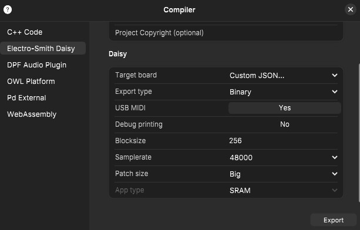
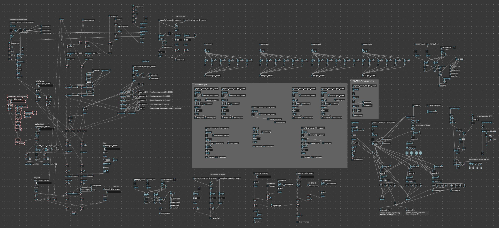

# THIS IS A SELF-TRIGGERING DISTORTION FX FOR SYNTHUX SIMPLE TOUCH

Made with Plugdata by jonwtr.

After watching the interview between Roey an Nick about how Audrey has -among a lot of other things-  a short delay in the feedback loop, I began experimenting with some of these concepts. That's resulted in now having a filter and a delay in a feedback loop that's passing through the simplest of distortion fx: clipping. By experimenting with the order of the delay/feedback, filter and clipping I landed on this iteration.

Interesting side effect of implementing this principle is that without any real input, the patch starts self oscillating when you hit the sweet spots / threshold of the delay time. Playing with the filter and timing will result in a droning effect.

When using this as a 'regular' distortion you'll probably want to keep the dry / wet value under control. Most often I find the sweet spots in the delay time in the smaller values. Opening up knob 5 and then playing with the right fader multiplier. Once you have a certain sweet spot, you might want to try adding a bit of LFO (knob4).

Also make sure to try out sending different amounts of volume to the input using your other gears output volume.

Please do feel free to further tweak this and let me know what can and should be improved.

> **Note 1** on the Plugdata patch, it's containing midi stuff that isn't working yet, the custom json file has no midi settings.

> **Note 2** as I started pushing this patch I started using a much larger blocksize of 256, I haven't stepped back down since I found it to be working just fine as is.

These were the settings while exporting the .bin

> **Note 3** This patch can use optimizing and perhaps removal of the unneeded parts, but as long as it compiles and not crashes I like to keep it together.

## Youtube demo

https://youtu.be/csmBTfaORss

another demo using two Simple Touches:

https://youtu.be/fztiZVzs79M

## QUICK INSTALL
Download the [Binary file selfdistort_touch_v1-3.bin](selfdistort_touch_v1-3.bin) and flash using the [Daisy web programmer](https://flash.daisy.audio/) You might need to install the bootloader first. (last tab on that page)

## CONTROLS

Note: In my Plugdata patches I number the knobs starting at 0, so 6 knobs, 0 - 5.

### **Switches**
- Left switch S09-OFF-S10 = on/off/on switch: **delay time modulator (lfo) timing**  multiplier
    - down: x 0.02
    - middle: x 0.4
    - up: x 0.8
- Rightswitch S07-OFF-S08 = on/off/on switch: **delay timing (fader right / S37)** & **pre-distortion (knob 1 / S31)** multiplier
    - up: (off) x 1
    - middle: x 0.25
    - down: x 0.5

### **Knobs**
- S30 Knob 00 - distortion amount
- S31 Knob 01 - pre-distortion filtering sweep between lowpass and highpass
- S32 Knob 02 - distortion DRY / WET [dry = completely untouched audio in, wet = all fx: change wet amount also by using the compressor (P05 + P08/P09)]
- S33 Knob 03 - post-distortion lowpass filter
- S34 Knob 04 - delay time LFO mix [gets very wild quickly, keep low or off]
- S35 Knob 05 - delay time mix [this will trigger the **selfdistort / droning** / finding a sweet spot will only trigger e.g. louder values]
- S36 Fader Left - end of chain volume out 
- S37 Fader Right - delay time multiplier of knob 5

### **Pads**

**LED's:** In my patch I've added LED animations to the user LED (led next to the boot button), but also to the 3 added LED's on my custom Touch 2
In general the flicker will mean the FX is turned on, a single blink means it's turned off.

- **P03 > P09**
    - altering amounts of distortion by influencing pre-distortion filter knob01
    - altering amounts of distortion by influencing timing of delay fader right
- Pads are divided between 3 parts left from middle P05, 3 parts right side.
    - Left pads subtract: P04 -0.16 / P05 -0.33 / P08 -0.66
    - right pads add: P06 +0.16 / P07 + 0.33 / P09 + 0.66
    - pads will add up to each other and to the value set by knob0 (values might 'fold' back)
- **P0 toggle: attack / decay toggle** - between long and short for pads P3-P9
    - default short attack and decay = 20ms
    - long attack / decay = 1000ms (1sec)
    - you can release pad before full value is reached
    - holding will sustain to pads max value
- **P1 : trigger an end of chain stereo FX: hv.comb - comb filter**
    - the toggle will load a different random set of values each time it's turned on
        - Feedforward amount (0...0.999);
        - Feedback amount (0...0.999);
        - Input delay time (0...50ms);
        - Delay update interpolation time (0...1000ms);
        - Output delay time (0...50ms);
    - no saving, once you press it's gone
- **P2: toggle a randomized sequencer** that goes through steps of added values to filter and timing.
    - change the speed by using P05 + P03/P07 - I'd like to link this to midi and or CV clock
- **P05 + P08/P09: compressor** hv.compressor2 is a simple stereo compressor change the threshold by using the up and down pad, hold middle pad and tap either left or right pad to in or decrease. 
- **P10: reset / clear delay buffer**
- **P11: toggle randomizer delay timing** mix

---

Plugdata patch getting too complicated for 1 screenshot, time to start using subpatches?

This was the flow chart I started with

