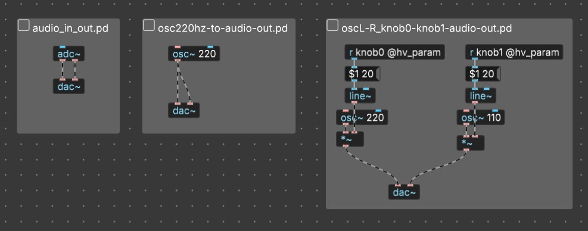
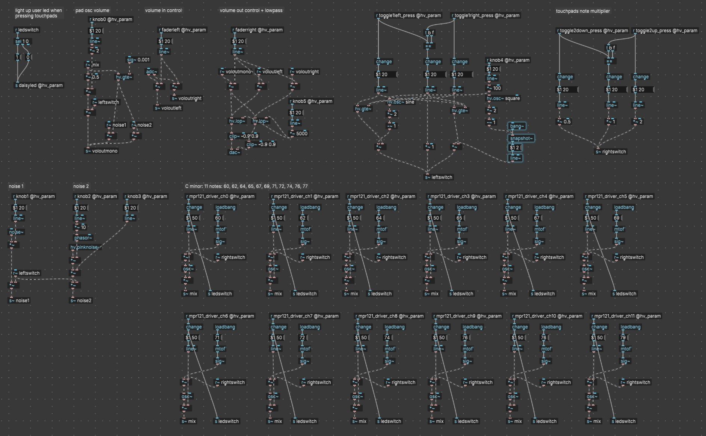

# Test patches - for Daisy Seed / Synthux Simple Touch

These are some simple hardware test patches that can be handy in debugging.

## Installation instructions:

Download the Binary files with the .bin extension and flash using the [Daisy Seed web programmer](https://electro-smith.github.io/Programmer/)

As we experienced some issues with different upload methods, here's a tested workflow:

1. Use Chrome and go to the [Daisy Seed web programmer](https://electro-smith.github.io/Programmer/)
2. Click the connect button
   - Connect your Daisy by using the button sequence:
      - press and hold 'boot' + press and release 'reset'
   - in the popup window choose DFU in FS mode
3. Go to the bottom **Programming Section** and choose **advanced** and flash the Bootloader image
4. Reconnect the Daisy now by using this new bootloader:
   - use this button sequence:
      - press and release 'reset'
      - press and release 'boot'
5. In the webuploader click on the connect button again and choose the bootlader option this time.

6. select the .bin file and press the upload button

## Three simple testing files:
1. Audio in straight through audio out
2. Steady 220 hz oscillator to audio out
3. 22O hz tone to left channel, 110 tone to right channel; both their volume controlled with the two most left knobs of Simple Touch (pins) 

I needed another simple test to find out the left and right channels of a jack. 
and wanted them to pulse alternating so:
4. osc220hzL_110hzR_pulsing_to_audio_out = an easy way to detect audio out L and R

Here's a handy list with all the pin numbers: [Daisy seed / Synthux Simple Pin numbering spreadsheet maintained by jonwtr](https://docs.google.com/spreadsheets/d/1xtg_s1tk8tm-6qNkBLFc6V1L_Mpmu-PCOvv7qEyr9mU/edit?usp=sharing)

| Daisy Pin | Description |  |  | pin number Simple PCB |
|---|---|---|---|---|
| 16 | in[0][SIZE] | audio in 1 |  | 16 |
| 17 | in[1][SIZE] | audio in 2 |  | 17 |
| 18 | out[0][SIZE] | audio out 1 |  | 18 |
| 19 | in[1][SIZE] | audio out 2 |  | 19 |
| 20 | A GND |  |  | 20 |
| 21 | 3V3 Analog |  |  | 29 |
| 22 | D15 | A0 | ADC 0 | 30 |
| 23 | D16 | A1 | ADC 1 | 31 |

---
---
## Full testing patch using all the inputs, sliders, knobs, pads, audio in and out

touchpadstest_osc_userled.bin
touchpadstest_osc_userled.pd

This is a larger testing patch that tests all the Simple Touch knobs, faders and pads.
Playing the pads will let you hear a simple sine oscillator and light the userled, faders control volume in and out, knobs control some noise and other stuff:

### Audio:
- Audio in volume = left fader
- Audio out volume = right fader

### Pads:
- pads 0 - 11 = 12 notes in C major 
- Touching the pads will trigger the userled next to the boot button

### Toggle switches:
- toggle switch on/off/on *Right* = multplier notes, x0.5 - x 1 - x 2 (so octave down, original notes, octave up)
- toggle switch on/off/on *Left* = engage an lfo turning the volume of the pads and the noise 1 and 2 on and off. 
   - left pos a sine osc
   - middle pos no effect
   - right pos square osc with smoothing
- The speed of the LFO is controlled by knob 4

 ### 6 Knobs

- knob0 = overall pad osc volume
- knob1 = noise 1 volume
- knob2 = pink noise 2 volume LFO with a phasor; affected by: 
- knob3 = pink noise 2 from knob2 volume
- knob4 = speed of the pads and noise LFO when using the switchleft in either left or right position
- knob5 = low pass filter `[hv.lop~]` on the overall audio out out

---
For the official Synthux website and all documentation go to [Synthux.academy](https://www.synthux.academy/)
